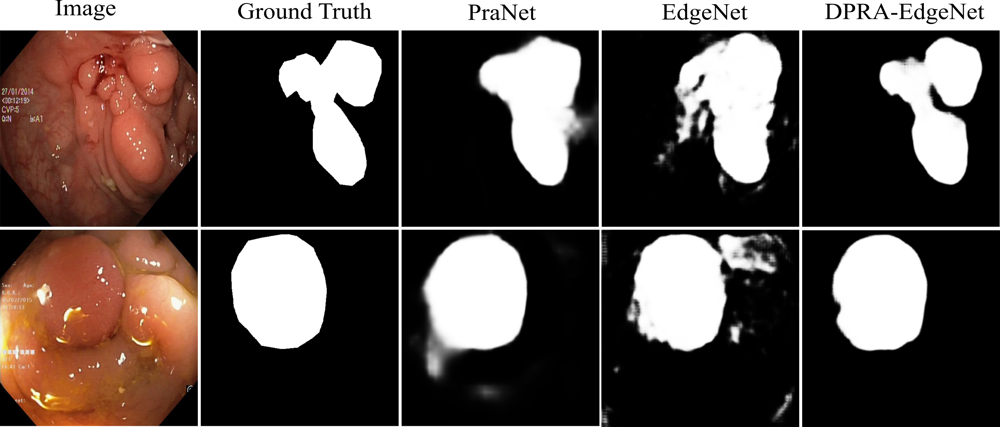
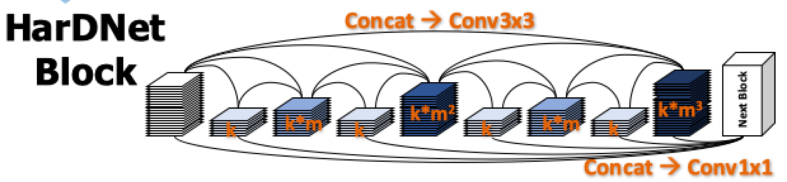

# Dual Paralle Reverse Attention Edge Net (DPRA-EdgeNet)
We propose Dual Parallel Reverse Attention Edge Network(DPRA-EdgeNet), an architecture that jointly learns to segment an object and its edge. Specifically, the model uses two cascaded partial decoders to form two initial estimates of the object segmentation map and its corresponding edge map. This is followed by a series of object decoders and edge decoders which work in conjunction with dual parallel reverse attention modules. The dual parallel reverse attention(DPRA) modules prunes the features to put emphasis on the object segmentation and the edge segmentation respectively. Furthermore, we propose a novel decoder blocks that uses spatial and channel attention 
to combine features from the previous decoder block and reverse attention (RA) module to enhance the feature representation learnt by the model. We compare our model against popular segmentation models such as UNet, SegNet and PraNet and demonstrate through a five fold cross validation experiment that our model improves the segmentation accuracy significantly on the Kvasir-SEG dataset. 


## HarDNet Architectures
#### For Image Classification : [HarDNet](https://github.com/PingoLH/Pytorch-HarDNet) A Low Memory Traffic Network
#### For Object Detection : [CenterNet-HarDNet](https://github.com/PingoLH/CenterNet-HarDNet) 44.3 mAP / 45 fps on COCO Dataset
#### For Semantic Segmentation : [FC-HarDNet](https://github.com/PingoLH/FCHarDNet)  76.0 mIoU / 53 fps on Cityscapes Dataset


## Main results
<p align="center">  </p>

### Performance on Kvasir-SEG Dataset  


| Models       | mIoU   | mDice  | Precision   | Recall   |
| :----------: | :----: | :----: | :-----------: | :--------: |
|U-Net         | 0.85  | 0.77  | 0.88         |0.86       | 
|SegNet |0.88| 0.81 |0.90 |0.91|
|PraNet |0.90| 0.85 |0.91 |0.92 |
|**DPRA-EdgeNet** |**0.92**   |  **0.86**| **0.93**|**0.93**|


###  Sample Inference Results on Kvasir-SEG Dataset of DPRA-EdgeNet against PraNet and EdgeNet(DPRA-EdgeNet without Dual Parallel Reverse Attention)

<p align="center">  </p>

## DPRA-EdgeNet Architecture
<p align="center">  </p> 

- Please download this image to view it properly.

- Encoder : HarDNet68 as backbone
- Using PraNet's Reverse Attention Block

<p align="center">  </p> 

```
    + k = growth rate (as in DenseNet)
    + m = channel weighting factor (1.6~1.7)
    + Conv3x3 for all layers (no bottleneck layer)
    + No global dense connection (input of a HarDBlk is NOT reused as a part of output)
```

- Decoder Part : Inspired by [Cascaded Partial Decoder](https://github.com/wuzhe71/CPD)

```
    + Using RFB Block for increasing the receptive field and strengthening the features.
    + Dense aggregation for fusing the features.
```

## Installation & Usage
### 1. Training/Testing


- Environment setting (Prerequisites):
    
    + `conda create -n *your_env_name* python=3.6`.
    
    + Then install PyTorch 1.1.

- Downloading necessary data:


    **For Kvasir-SEG Dataset reference from**
    [**Real-Time Polyp Detection, Localisation and Segmentation in Colonoscopy Using Deep Learning**](https://arxiv.org/abs/2011.07631)
    
   
    + Kvasir-SEG dataset and move it into your train_path
    which can be found [here](https://datasets.simula.no/kvasir-seg/).
    + Kvasir-Instruments dataset and move it into your train_path
    which can be found [here](https://datasets.simula.no/kvasir-instrument/).
   
- Training :

    1. First download pretrain_weight : hardnet68.pth for HarDNet68 in https://github.com/PingoLH/Pytorch-HarDNet  
    
    2. Change the weight path in lib/hardnet_68.py line 203 for loading the pretrain_weight  
    
    3. Change the --train_path & --test_path in Train.py  
    
    4.  Divide your dataset into train, validation and test sets using make_train_val_k_fold_crossvd.py. 

    5.  Augment data using data_augmentation_nora.py
    
    6.  Make sure that the folder inside train, validation and test have subfolders "image","mask" and "edge_mask"
    
    7.  You can create edge maps using create_edge_mask.py script.

Shell script example to train your model. 
```
python Train.py --ckpt_folder nora_polyp_512_1 --trainsize 512 --batchsize 4  --train_path /home/debayan/Desktop/MedAI_Project/new_data/nora_polyp_new/0/train --val_path /home/debayan/Desktop/MedAI_Project/new_data/nora_polyp_new/0/validate/ --model DPRAEdgeNet
```

- Testing & inference result :

    1. Change the data_path, model_path, save_path in Test.py. data_path is the path to your test dataset. model_path is the path to the model chekpoint, save_path is the path to store the predictions of the model. 
    
- Evaluate models :

    1. Use calculate_metrics.py to calculate the IoU, DSC, Precision and Recall for individual models.
    2. Use calculate_consolidated_metrics.py to calculate the average metrics incase you have K-Fold-Cross VD strategy. 
     
### 3. Acknowledgement

- Part of the code is borrowed from     
**PraNet** (https://github.com/DengPingFan/PraNet) (https://arxiv.org/abs/2006.11392)     
**HarDNet-MSEG** (https://github.com/james128333/HarDNet-MSEG) (https:https://arxiv.org/abs/2101.07172)        
**DDANet** (https://github.com/nikhilroxtomar/DDANet) (https://arxiv.org/abs/2012.15245)    

I deeply appreciate their work! It would have taken me lot more time otherwise! Thank you!


## Citation
If you find this project useful for your research, please use the following BibTeX entry.
    TBA
